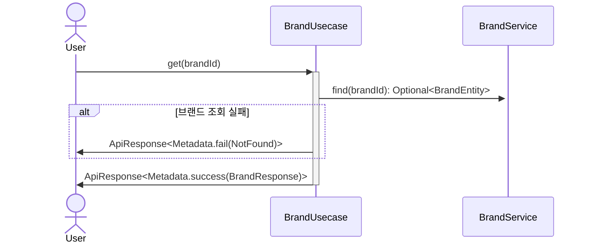
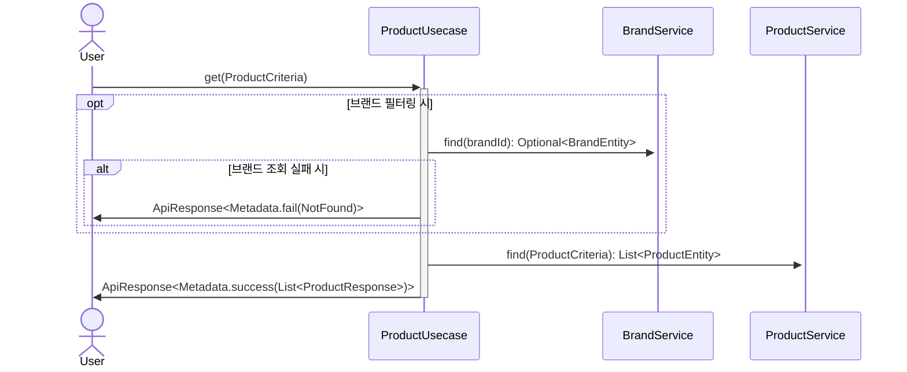
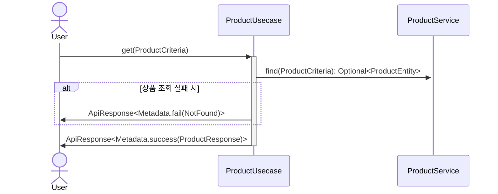
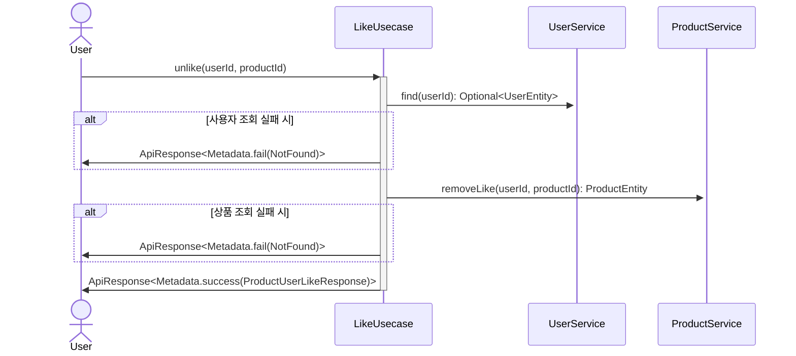
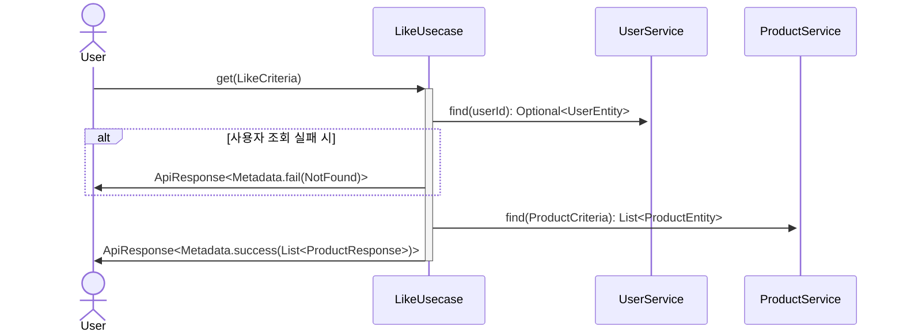
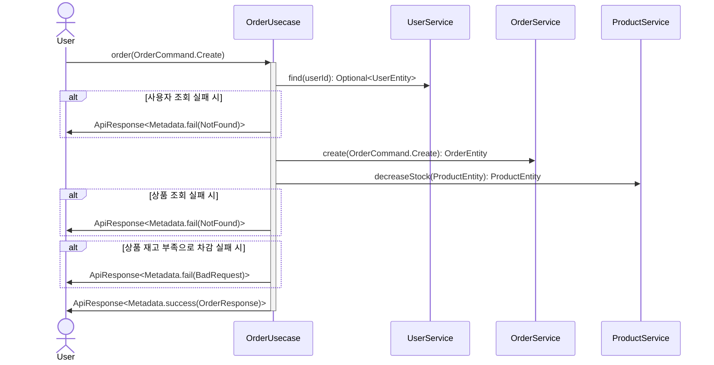
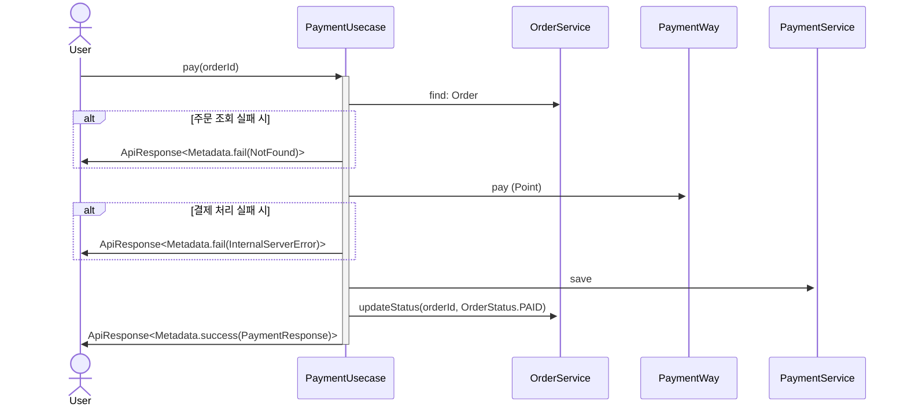
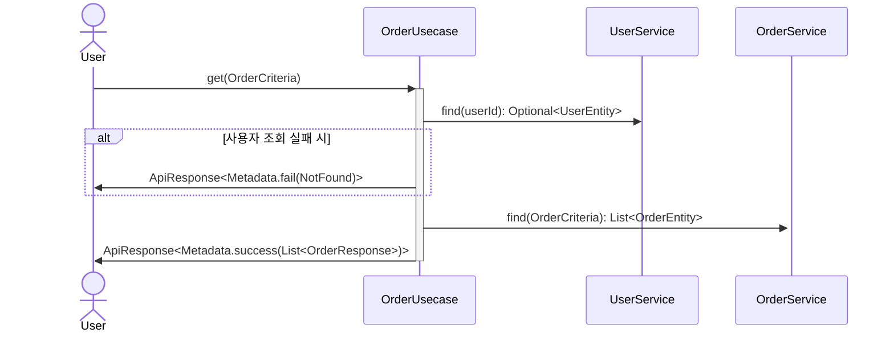
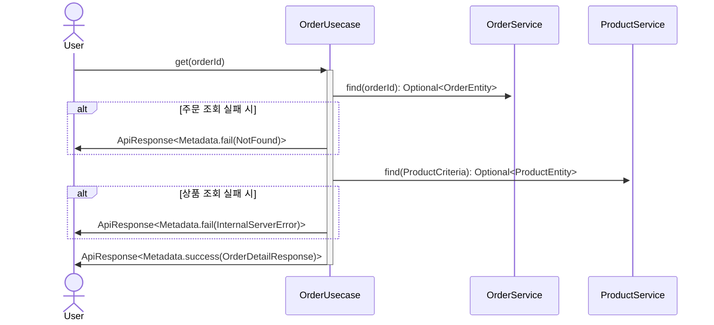

- 상품 목록 / 상품 상세 / 브랜드 조회
- 상품 좋아요 등록/취소 (멱등 동작)
- 주문 생성 및 결제 흐름 (재고 차감, 포인트 차감, 외부 시스템 연동)

## 브랜드 & 상품 (Brands / Products)

### 브랜드 조회

### 상품 목록 조회

- 브랜드 필터링
- 정렬 기준 (최신순, 가격 오름차순, 좋아요 내림차순 등)
- 페이징 처리
- 좋아요 표기

### 상품 정보 조회

- 좋아요 표기

## 좋아요 (Likes)

- 상품 좋아요 등록/취소 (멱등 동작)
- 사용자는 **각 상품에 한 번만 좋아요** 를 누를 수 있습니다.
- 상품에 대한 **좋아요 추가/해제** 기능은 멱등하게 동작하여야 합니다.
- 상품 목록, 상품 상세 정보 조회 시 **총 좋아요 수**를 표기해야 합니다.

### 상품 좋아요 등록

### 상품 좋아요 취소

### 내가 좋아요 한 상품 목록 조회

## 주문 / 결제 (Orders/Payments)

- 주문 생성 및 결제 흐름 (재고 차감, 포인트 차감, 외부 시스템 연동)
- {상품 아이디, 수량} 리스트
- 상품 재고 확인 및 차감
- 포인트 확인 및 차감
- 주문 정보 외부 시스템 전송 (Mock 처리 가능)

### 주문 요청

### 결제 요청

### 유저의 주문 목록 조회

### 단일 주문 상세 조회

