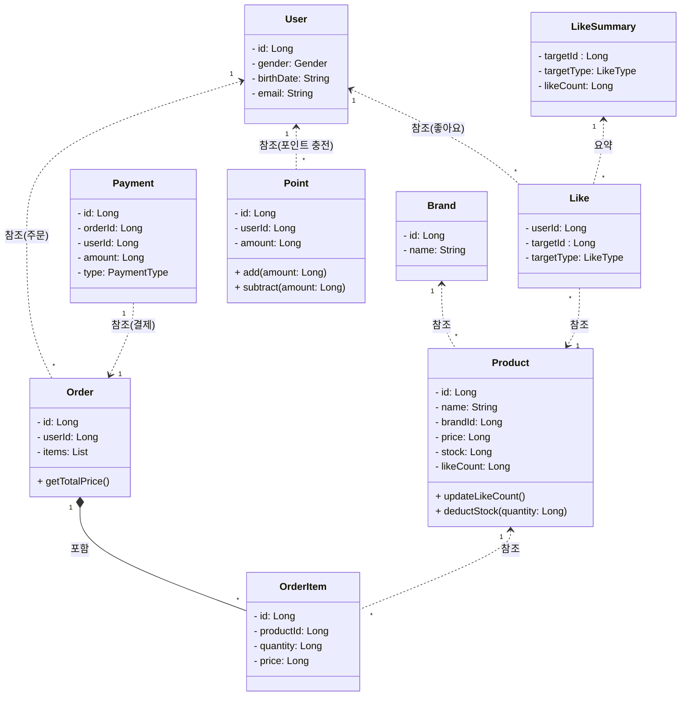

- 모든 클래스는 BaseEntity를 상속받아 공통 속성(createdAt, updatedAt, deletedAt)을 가짐.
- Like는 BaseEntity를 상속받지 않음.

```mermaid
classDiagram
    class Brand {
        - id: Long
        - name: String
    }

    class Product {
        - id: Long
        - name: String
        - brandId: Long
        - price: Long
        - stock: Long
        - likeCount: Long
        + updateLikeCount()
        + deductStock(quantity: Long)
    }
    Brand "1" <.. "*" Product: 참조

    class Like {
        - userId: Long
        - targetId : Long
        - targetType: LikeType
    }
    User "1" <.. "*" Like: 참조(좋아요)
    Like "*" ..> "1" Product: 참조
    
    class LikeSummary {
        - targetId : Long
        - targetType: LikeType
        - likeCount: Long
    }
    LikeSummary "1" <.. "*" Like: 요약

    class User {
        - id: Long
        - gender: Gender
        - birthDate: String
        - email: String
    }
    
    class Point {
        - id: Long
        - userId: Long
        - amount: Long
        + add(amount: Long)
        + subtract(amount: Long)
    }
    User "1" <.. "*" Point: 참조(포인트 충전)

    class Order {
        - id: Long
        - userId: Long    
        - items: List<OrderItem>
        + getTotalPrice()
    }
    Order "1" *-- "*" OrderItem: 포함
    User "1" <.. "*" Order: 참조(주문)

    class OrderItem {
        - id: Long
        - productId: Long
        - quantity: Long
        - price: Long
    }
    Product "1" <.. "*" OrderItem: 참조
    
    class Payment {
        - id: Long
        - orderId: Long
        - userId: Long
        - amount: Long
        - type: PaymentType
    }
    Payment "1" ..> "1" Order: 참조(결제)
```
