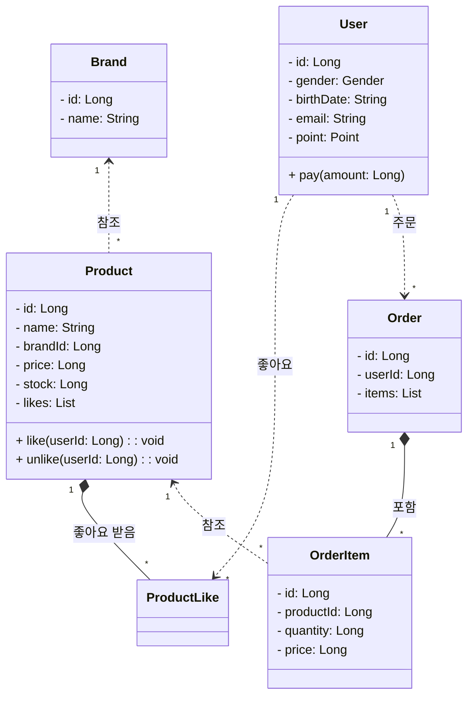

- 모든 클래스는 BaseEntity를 상속받아 공통 속성(createdAt, updatedAt, deletedAt)을 가짐.
- ProductLike는 BaseEntity를 상속받지 않음.

```mermaid
classDiagram
    class Brand {
        - id: Long
        - name: String
    }

    class Product {
        - id: Long
        - name: String
        - brandId: Long
        - price: Long
        - stock: Long
        - likes: List<ProductLike>
        + like(userId: Long): void
        + unlike(userId: Long): void
    }
    Brand "1" <.. "*" Product: 참조
    Product "1" *-- "*" ProductLike: 좋아요 받음

    class ProductLike {
    }

    class User {
        - id: Long
        - gender: Gender
        - birthDate: String
        - email: String
        - point: Point
        + pay(amount: Long)
    }
    User "1" ..> "*" ProductLike: 좋아요

    class Order {
        - id: Long
        - userId: Long    
        - items: List<OrderItem>
    }
    Order "1" *-- "*" OrderItem: 포함
    User "1" ..> "*" Order: 주문

    class OrderItem {
        - id: Long
        - productId: Long
        - quantity: Long
        - price: Long
    }
    Product "1" <.. "*" OrderItem: 참조
```
