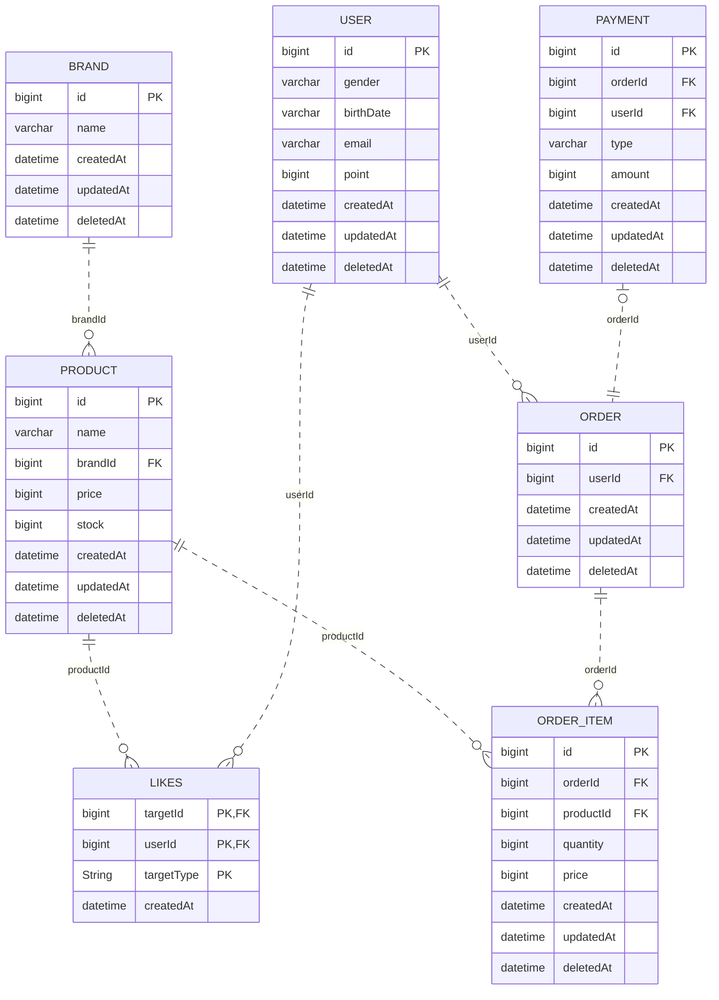

- FK는 실제 데이터베이스의 외래 키 제약 조건을 의미하지 않습니다.

```mermaid
erDiagram
    BRAND {
        bigint id PK
        varchar name
        datetime createdAt
        datetime updatedAt
        datetime deletedAt
    }
    PRODUCT {
        bigint id PK
        varchar name
        bigint brandId FK
        bigint price
        bigint stock
        datetime createdAt
        datetime updatedAt
        datetime deletedAt
    }

    LIKES {
        bigint targetId PK, FK
        bigint userId PK, FK
        String targetType PK
        datetime createdAt
    }
    ORDER {
        bigint id PK
        bigint userId FK
        datetime createdAt
        datetime updatedAt
        datetime deletedAt
    }
    ORDER_ITEM {
        bigint id PK
        bigint orderId FK
        bigint productId FK
        bigint quantity
        bigint price
        datetime createdAt
        datetime updatedAt
        datetime deletedAt
    }
    USER {
        bigint id PK
        varchar gender
        varchar birthDate
        varchar email
        bigint point
        datetime createdAt
        datetime updatedAt
        datetime deletedAt
    }
    PAYMENT {
        bigint id PK
        bigint orderId FK
        bigint userId FK
        varchar type
        bigint amount
        datetime createdAt
        datetime updatedAt
        datetime deletedAt
    }
    BRAND ||..o{ PRODUCT : brandId
    PRODUCT ||..o{ LIKES : productId
    PRODUCT ||..o{ ORDER_ITEM : productId
    ORDER ||..o{ ORDER_ITEM : orderId
    USER ||..o{ ORDER : userId
    USER ||..o{ LIKES : userId
    PAYMENT |o..|| ORDER : orderId
```
